

# brunnodev

### SYSTEMS BUILDER / BRAZIL → GLOBAL

Architecture, journeys and technical decisions focused on operational results.

SCADA, PLC, IoT, automation and signal reading for real processes.

I connect engineering thinking, digital product and operational context to turn messy requirements into usable systems.

> This is not a portfolio. It is not a services page. It is a working laboratory.

## Systems map

<b>01 — Automation & industrial logic</b>

 

Electrical commands, PLC/SCADA thinking and process visibility.

**PLC / SCADA / SIGNAL CONTROL / MODBUS / PID**

<b>02 — IoT & telemetry</b>

 

Sensors, connected devices, cloud signals and real-time product feedback.

**ARDUINO / CLOUD IoT / TELEMETRY / WEBSOCKETS / SENSOR NETWORKS**

<b>03 — System architecture</b>

 

APIs, integrations, security boundaries and sustainable technical decisions.

**BANK APIs / SECURITY SYSTEMS / DATABASES / AWS / SYSTEM DESIGN**

<b>04 — Android field interfaces</b>

 

Touch-first surfaces for mobile operators and hardware-aware workflows.

**KOTLIN / MOBILE UX / DEVICE STATES / FIELD OPERATIONS**

<b>05 — POS & payment systems</b>

 

Checkout, catalog, inventory, cash control and role-based operations.

**STONE / SUNMI / POS / QR / OPERATOR UX**

## Core capabilities

## Companies I lead

| Company | Role | Operating focus |
|---|---|---|
| [RF Offshore](https://rf-offshore.com/) | **CEO** | Industrial, offshore and field operations |
| [RF WALLMARKET](https://rfwallmarket.com/) | **CEO** | Autonomous retail, infrastructure and operational technology |

## Project images

<b>RF Solutions × Stone — POS System</b>

 

  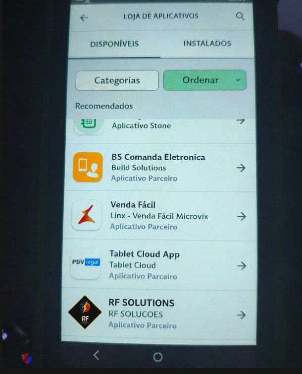

<b>OFS — Offshore Fleet POB Platform</b>

 

  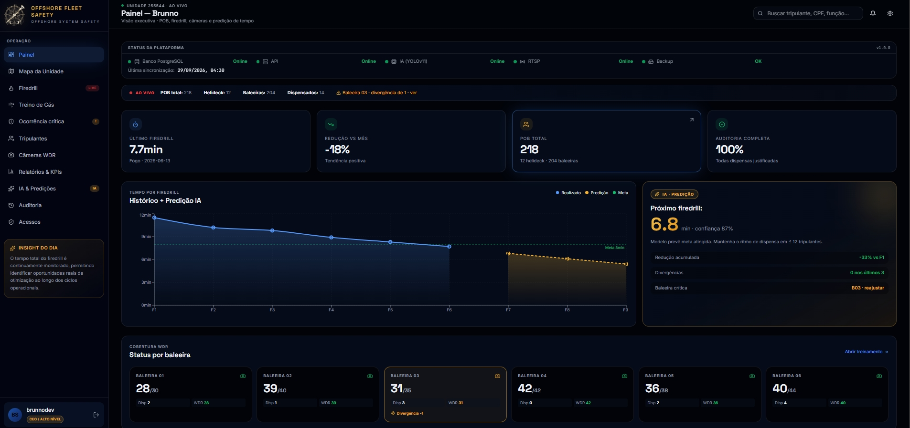
  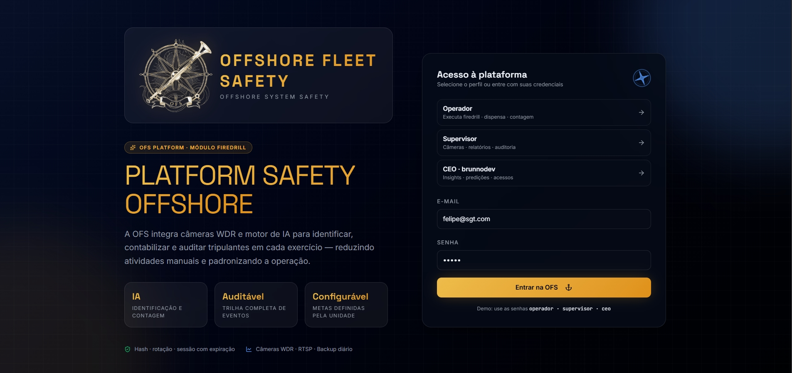

<b>Arduino Telemetry</b>

 

  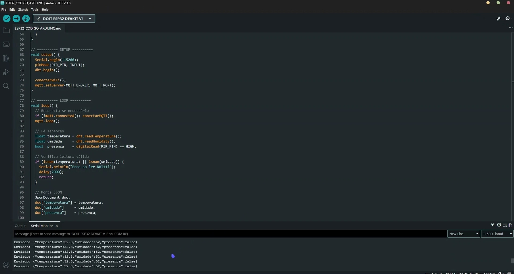
  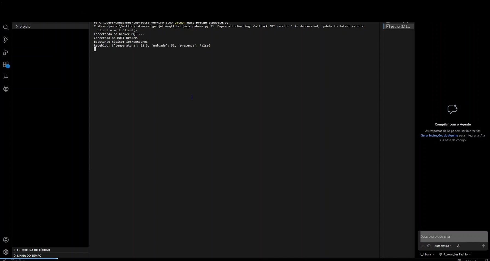
  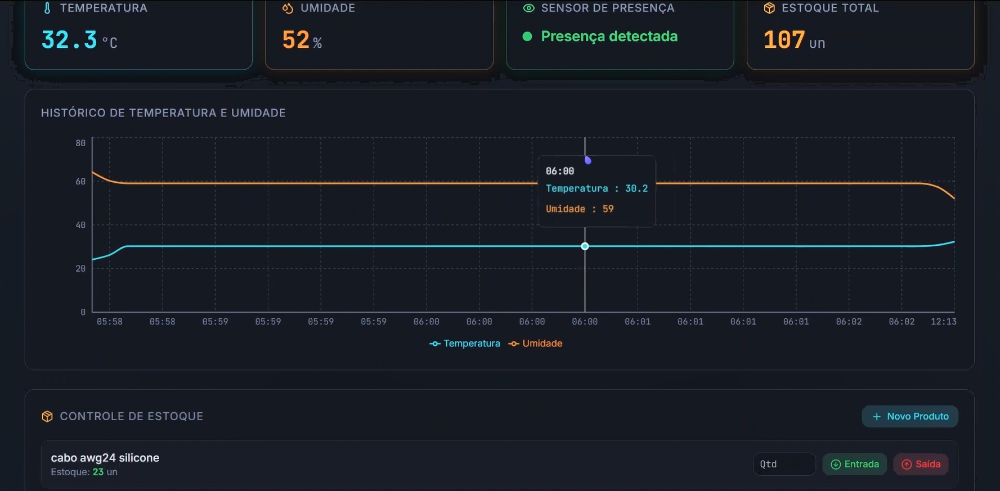
  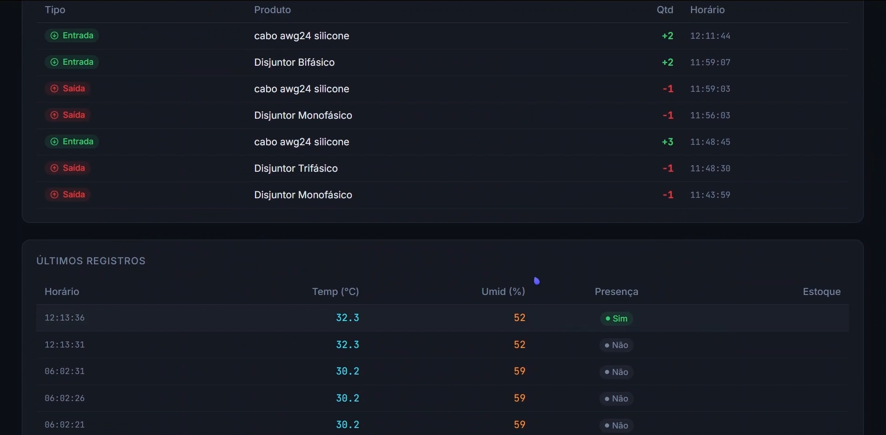
  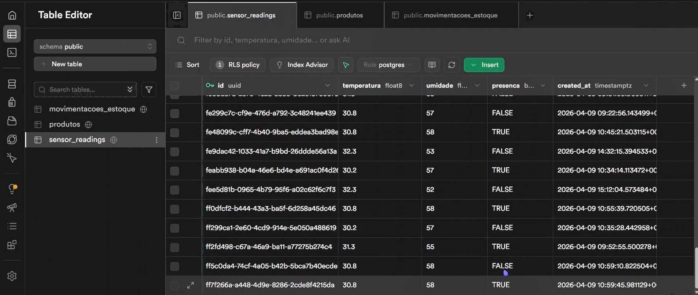

<b>Just for Fun</b>

 

  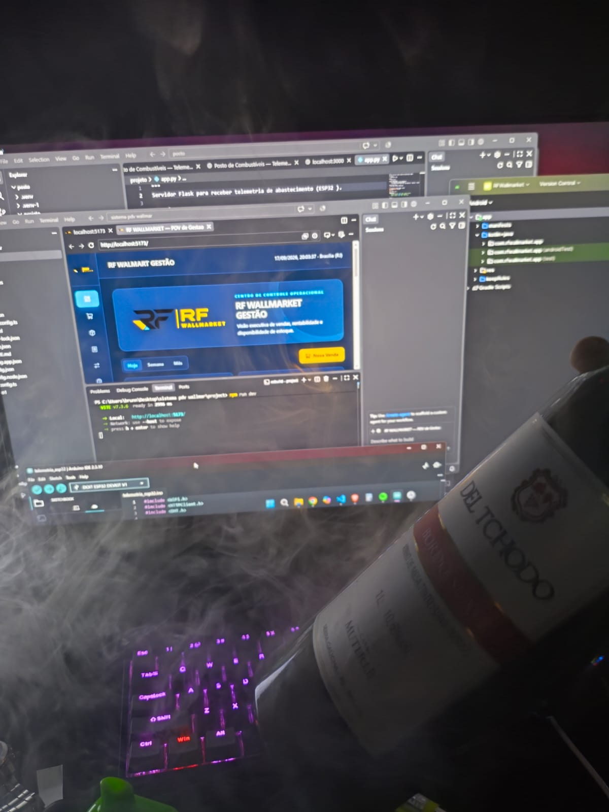
  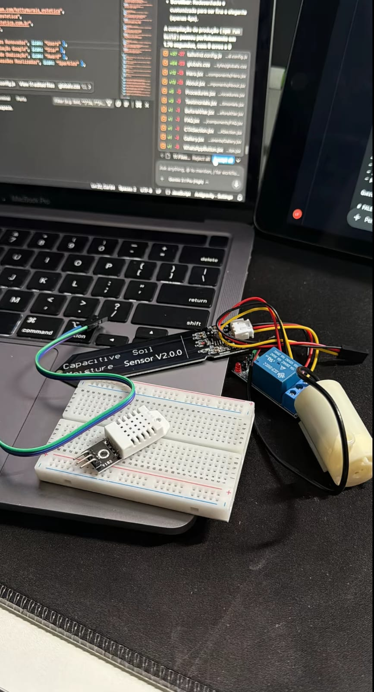
  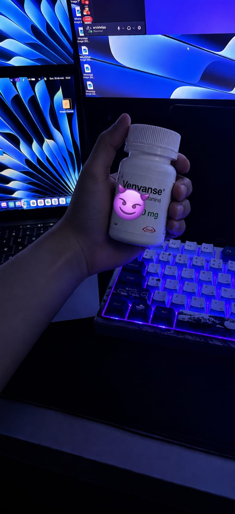

**BUILD SYSTEMS. READ SIGNALS. SHIP OPERATIONS.**

[brunnodev.store](https://brunnodev.store/)

## Projects

[View all projects](https://github.com/brunnojob/brunnojob/blob/main/PROJECTS.md)

## License

Original source and documentation are MIT licensed; see [LICENSE](LICENSE). Third-party dependencies and media retain their respective terms. Maintained by [Brunno Dev](https://brunnodev.store).

## Native implementations

| Language / target | Working source |
|---|---|
| C17 | [Durable archive client](https://github.com/brunnojob/vercel-home-telemetry-api/tree/main/clients/c) |
| C++ | [Concurrent task queue](https://github.com/brunnojob/cpp-safe-task-queue) |
| C# | [Supabase inventory API](https://github.com/brunnojob/csharp-pantry-api) |
| Java | [Balanced ledger](https://github.com/brunnojob/bank-crypto-ledger) |
| Kotlin | [Android inspections](https://github.com/brunnojob/android-offshore-field-console) |
| Swift | [Native inspection store](https://github.com/brunnojob/android-offshore-field-console/tree/main/ios) |
| Ruby | [Git collaboration auditor](https://github.com/brunnojob/pair-extraordinaire-badge) |
| IEC 61131-3 Structured Text / PLC | [Circuit exporter](https://github.com/brunnojob/eletrical-comands-and-teory) |
| SCADA | [Control studio](https://github.com/brunnojob/scada-code-studio) |

---

## 📊 Live GitHub Analytics & Metrics

| 📈 Estatísticas Gerais | 💻 Linguagens Mais Usadas |
| :---: | :---: |
|  |  |

### 🌐 Conecta-ti & Colabora
> *Focado em transformar código, hardware e sistemas em soluções reais.*

  
  
  

https://brunnodev.store

